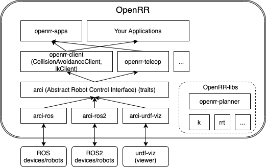

# openrr: `Open Rust Robotics`

 [](https://crates.io/crates/openrr) [](https://codecov.io/gh/openrr/openrr) [](https://docs.rs/openrr)

Open Rust Robotics platform.

## Dependencies

### Linux

```bash
sudo apt install cmake build-essential libudev-dev
```

* cmake build-essential (openrr-planner (assimp-sys))
* libudev-dev (arci-gamepad-gilrs)

## Architecture



`arci` is a hardware abstruction layer for openrr.
Currently [ROS1](https://ros.org) and [urdf-viz](https://github.com/openrr/urdf-viz) (as a static simulator (actually it's just a viewer)) are implemented.

You can write platform/hardware independent code if you use `arci` traits.

## Examples

TODO:

## License

Apache2

## Related openrr repositories

* [k](https://github.com/OpenRR/k) : kinematics library
* [ros-nalgebra](https://github.com/OpenRR/ros-nalgebra) : rosrust nalgebra converter generator
* [rrt](https://github.com/OpenRR/rrt) : RRT-dual-connect path planner
* [trajectory](https://github.com/OpenRR/trajectory) : trajectory interpolator
* [urdf-rs](https://github.com/OpenRR/urdf-rs) : URDF parser
* [urdf-viz](https://github.com/OpenRR/urdf-viz): URDF visualizer
* ~~[gear](https://github.com/OpenRR/gear)~~ : (deprecated) motion planning library, but it is openrr-planner now.
